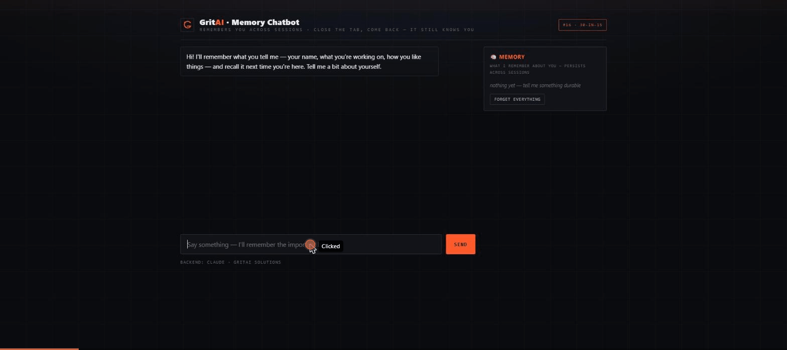

# Memory Chatbot 🧠

A chatbot that **remembers you across sessions.** Close the tab, come back tomorrow — it still knows your
name, what you're working on, and how you like things.

> Project **#16** of the *"30 AI Projects in 15 Days"* challenge. Focus: **memory architecture + state.**



*Above: I introduce myself → facts land in the Memory panel → **the page reloads** (chat wipes to blank) → I ask "what do you remember about me?" → it recalls everything from the previous session.*

## The lesson: buffer vs long-term memory
Most chatbots only have a **conversation buffer** — the current session's messages. Reload and they forget
you. This one adds **long-term memory**, in four moves:
1. **Extract** — after each exchange, an LLM pulls durable facts about you (name, preferences, projects).
2. **Store** — facts go to a local DB, keyed by user, deduped. *This is what survives the session.*
3. **Retrieve** — on every turn, your stored facts are loaded.
4. **Inject** — they're placed in the system prompt, so the bot recalls you.

A live **🧠 Memory panel** shows exactly what it remembers, and lets you delete any fact or forget everything —
memory you can see and control.

## Run it
```bash
pip install -r requirements.txt
python app.py            # http://127.0.0.1:7860
# Local Ollama by default (free/private); set ANTHROPIC_API_KEY for the Claude backend.
```

## Prove the memory works
Tell it your name and what you're building, then **reload the page** (or come back later) — it still knows.
Different browser / cleared cookies = a fresh user with its own memory.

---
Built by **Robert Lucyk** · [GritAI Solutions](https://gritai.solutions) · part of the 30-in-15 challenge.
